# AWS Architecture Diagram

This diagram reflects the deployed BioIT genome pipeline in AWS account `443568785165` in `us-east-1`.

## Service Map

```mermaid
flowchart LR
    subgraph Clients["Clients and Inputs"]
        User["User / CLI / Python Client"]
        NCBI["NCBI Entrez / Reference Genome Source"]
        Ensembl["Ensembl / Direct URL Sources"]
    end

    subgraph Ingestion["Job Ingestion"]
        SQS["Amazon SQS\n`genome-pipeline-queue`"]
        DLQ["Amazon SQS DLQ\n`genome-pipeline-dlq`"]
        SFN["AWS Step Functions\n`genome-pipeline-state-machine`"]
        EBR["Amazon EventBridge\nScheduled / optional orchestration"]
    end

    subgraph Compute["Processing"]
        Lambda["AWS Lambda\n`genome-pipeline-processor`\nPython + C++ parser layer"]
        CWL["Amazon CloudWatch Logs\n`/aws/lambda/genome-pipeline-processor`"]
    end

    subgraph Storage["Data Lake Storage"]
        Temp["Amazon S3 Temp Bucket\n`genome-pipeline-temp-443568785165`"]
        Out["Amazon S3 Output Bucket\n`genome-pipeline-output-443568785165`"]
        Results["Amazon S3 Athena Results Bucket\n`genome-pipeline-athena-results-443568785165`"]
    end

    subgraph Catalog["Catalog and Governance"]
        Crawler["AWS Glue Crawler\n`genome-pipeline-crawler`"]
        CatalogDB["AWS Glue Data Catalog\n`genome_pipeline_db`"]
        LF["AWS Lake Formation"]
    end

    subgraph Query["Analytics"]
        Athena["Amazon Athena\n`genome-pipeline-workgroup`"]
        Named["Saved Athena Queries\nsequence + pattern + region analysis"]
    end

    User -->|"Submit chromosome jobs"| SQS
    User -->|"Optional direct invoke"| Lambda
    User -->|"Optional workflow start"| SFN
    EBR --> SFN
    SFN --> Lambda
    SQS --> Lambda
    SQS -. failed messages .-> DLQ

    Lambda -->|"Download FASTA / sequence payloads"| NCBI
    Lambda -->|"Optional source support"| Ensembl
    Lambda -->|"Scratch files / staging"| Temp
    Lambda -->|"Parquet outputs:\n`genome_data/`\n`pattern_data/`\n`region_data/`"| Out
    Lambda --> CWL

    Out --> Crawler
    Crawler --> CatalogDB
    Out --> LF
    CatalogDB --> LF
    CatalogDB --> Athena
    LF --> Athena
    Athena --> Results
    Named --> Athena

    classDef compute fill:#F59E0B,stroke:#92400E,color:#111827
    classDef storage fill:#10B981,stroke:#065F46,color:#111827
    classDef query fill:#60A5FA,stroke:#1D4ED8,color:#111827
    classDef ingest fill:#FCA5A5,stroke:#B91C1C,color:#111827
    classDef catalog fill:#C4B5FD,stroke:#6D28D9,color:#111827
    classDef clients fill:#E5E7EB,stroke:#6B7280,color:#111827

    class Lambda,CWL compute
    class Temp,Out,Results storage
    class Athena,Named query
    class SQS,DLQ,SFN,EBR ingest
    class Crawler,CatalogDB,LF catalog
    class User,NCBI,Ensembl clients
```



## Main Runtime Flow

1. A client submits one chromosome job to `genome-pipeline-queue`.
2. Lambda receives the SQS event, unwraps `Records[*].body`, and downloads the requested chromosome from NCBI or another configured source.
3. The Lambda layer runs the Linux C++ parser to produce:
   - `sequences`
   - `patterns`
   - `regions`
4. Lambda converts those outputs to Parquet and writes them into Hive-partitioned S3 paths under:
   - `genome_data/`
   - `pattern_data/`
   - `region_data/`
5. Glue crawler and Glue tables expose the partitioned data to Athena.
6. Athena reads through `genome_pipeline_db`, and query results are written to the Athena results bucket.

## Dataset Layout

All analysis datasets use the same partition shape:

```text
s3://genome-pipeline-output-443568785165/
  <dataset>/
    source=<source>/
      species=<species>/
        chr=<chromosome>/
          year=<YYYY>/
            month=<MM>/
```

Datasets currently produced:

- `genome_data/` for sequence-level outputs
- `pattern_data/` for motifs, repeats, and candidate ORFs
- `region_data/` for sliding-window summaries used in visualization and hotspot analysis

## Query Layer

The current analytics surface in Athena includes:

- `genome_sequences`
- `sequence_patterns`
- `sequence_regions`

Saved query coverage includes:

- chromosome-level summaries
- GC hotspot windows
- repeat-dense windows
- ORF-rich regions
- pattern-heavy windows
- joined motif/GC/ORF hotspot analysis

## Operational Notes

- Use `AwsDataCatalog` and database `genome_pipeline_db` in Athena.
- For bulk chromosome ingestion, prefer the Python client or `json.dumps(...)` payload generation instead of hand-built shell JSON.
- Malformed SQS JSON can still be accepted by SQS and then fail later in Lambda, eventually surfacing in the DLQ.
