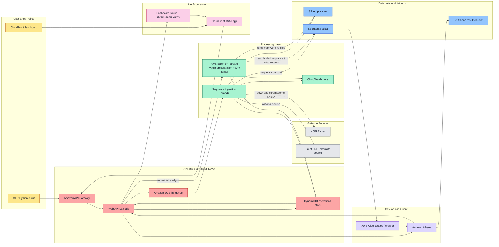

# AWS Architecture Diagram: Batch-First Runtime

This architecture view reflects the current deployed BioIT genome pipeline in AWS account `443568785165` in `us-east-1`.

It captures the current batch-first processing path, dashboard/API layer, and operational status tracking used by the live system.

## Service Map



## Batch-First Runtime

1. A user submits a chromosome request from the dashboard or client.
2. The web API records operational state in DynamoDB and routes the request into the pipeline.
3. Sequence ingestion Lambda downloads and lands the chromosome sequence parquet in S3.
4. Full analysis is submitted to AWS Batch on Fargate.
5. The Batch container runs the C++ parser and Python analysis flow, then writes:
   - `genome_data/`
   - `pattern_data/`
   - `region_data/`
6. Glue/Athena expose those datasets for query.
7. The dashboard API reads both Athena and DynamoDB so the UI can show:
   - chromosome readiness
   - analysis progress
   - summary card values
   - lens and atlas visualizations

## Operational State

DynamoDB is used as the operational store for near-real-time status rather than as the analytical system of record.

Typical state captured there includes:

- job submission metadata
- latest phase (`queued`, `running`, `syncing`, `complete`, `failed`)
- Batch job identifiers
- timestamps and elapsed time
- progress hints shown in the dashboard
- failure messages for troubleshooting

## Data Products

The pipeline currently exposes these main analytical datasets:

- `genome_sequences`
- `sequence_patterns`
- `sequence_regions`
- `gene_annotations` when annotation data is loaded

Partition layout is Hive-style:

```text
source=<source>/species=<species>/chr=<chromosome>/year=<YYYY>/month=<MM>/
```

## Why This Diagram Exists

This version is aligned with the current deployed system, where:

- full analysis is Batch-first
- Lambda is mainly used for ingestion and lightweight API/orchestration work
- DynamoDB stores operational progress
- Athena remains the analytical query layer
- CloudFront and the dashboard API provide the live visualization surface
